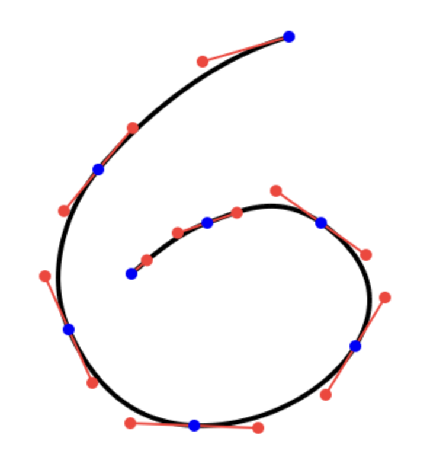

# Advanced Graphics: Homework Assignment 1: Curve Editor

## Overview

In this assignment, you will implement several kinds of interpolating splines. Splines are the backbone of smooth shapes and motions in computer graphics. Your splines will interpolate a sequence of given points. The output could look like this:



There is a demo you can interact with here:

<https://yig.github.io/graphics662-curves/serve/CurveWASM.html>

## Setup

Download or clone this code repository. Don't fork it on GitHub, or else your code will be visible to everyone. If you want to work on it on GitHub, use <https://github.com/new/import> to create an independent, private copy by pointing it at this repository's URL and choosing "Private".

You will need a working C++ compiler and [CMake](https://cmake.org/).
  * On Windows, you can install Visual Studio with its [C++ CMake tools for Windows](https://learn.microsoft.com/en-us/cpp/build/cmake-projects-in-visual-studio). Then you can open a folder with a `CMakeLists.txt` in Visual Studio directly instead of running any of the command line commands. To install command line CMake, you can use the CMake installer from the [official website](https://cmake.org/).
  * On macOS, you should install `Xcode` via the `App Store`. For CMake, use [Homebrew](https://brew.sh/): `brew install cmake`.
  * On Linux, use your distribution's package manager to install a compiler (clang or gcc) and cmake.

(Recommended) Install [websocketd](http://websocketd.com/). The websocketd page has downloadable binaries for many platforms. You can put the binary next in the top-level directory (next to `CMakeLists.txt`). macOS users should install it via `brew install websocketd`.

## Compiling

Use CMake to setup your build system: `cmake -B build-dir`. Compile with `cmake --build build-dir`.

> 🤖: For more information about using CMake, see [this guide](https://github.com/yig/GMU-CS425) I wrote for a different course (up through *Checkpoint 1 Upload*). Use `ccmake -B build-dir` to choose compile-time options. (Note the extra `c`.) One useful option is `CMAKE_BUILD_TYPE`. You can choose `Release` (optimized code generation), `Debug` (unoptimized code with debug information) or `RelWithDebInfo` (optimized code with debug information; may be hard to debug since compilers move code around when optimizing). You can pass options on the command line with `-D`, as in `cmake -B build-dir -DCMAKE_BUILD_TYPE=Debug`.

## Running

To compile and run the assignment: `cmake --build build-dir --target run_GUI`. Then open <http://localhost:8000/Curve.html> in a web browser. You may need to change lines 125 and 127 in `CMakeLists.txt` so that it finds your `websocketd`.

There is a tester available:
  ```
  cd test
  ctest --verbose
  ```

## (Optional) Compiling and Running with WebAssembly

You can compile your code for the web (to WebAssembly) and run it entirely in-browser with [emscripten](https://emscripten.org). Follow [the instructions to install and activate the Emscripten SDK](https://emscripten.org/docs/getting_started/downloads.html). (You don't need `websocketd` for this.)

1. Setup the build system with `emcmake cmake -B build-web`.

2. Compile with `cmake --build build-web`.

3. Run by serving the contents of the `serve` directory and opening `CurveWASM.html` in a web browser. For example,
    ```
    cd serve
    python3 -m http.server 8001
    ```
    and then browsing to `<http://localhost:8001/CurveWASM.html>`.

## (Optional) Compiling and Running without websocketd

To compile and run without websocketd, use `ccmake -B build-dir` and set the `BUILTIN_WEBSOCKET_SERVER` flag to `ON`. (You can also directly edit the `CMakeLists.txt` to set the default to `ON`.) When you do this, a new target will appear, `CurveWSServer`. It will listen for WebSocket connections on port 8000. You will need to run a static web server in the `serve` directory to serve the web GUI, as in `python3 -m http.server -d serve 8001` and then open your browser to <http://localhost:8001/Curve.html>.

## Writing

Fill in the functions in the file `CurveFunctions.cpp`. That's the only file you need to change.

**Note:** Don't print extra messages to standard output (e.g., `std::cout`). Instead, print messages to standard error (`std::cerr`). The code uses standard input and output to communicate via WebSocket with the GUI.

**THIS IS AN INDIVIDUAL, NOT A GROUP ASSIGNMENT. That means all code written for this assignment should be original! Code that is substantially the same will be considered cheating.** You may work on theoretical derivations with other students, but not code. In your `Notes.txt`, please note who deserves a star (who helped you with the assignment).

## Debugging

You can debug the tester binary by running `build-dir/test/evaluate` in your debugger.

You can debug the GUI, too. After you open the web page, the browser will connect via websocket to `websocketd`, which will launch the `serve/CurveJSONServer` binary. Then you can attach to the `CurveJSONServer` process in your debugger. If this doesn't work for you, try the `BUILTIN_WEBSOCKET_SERVER` approach.

If you are using the optional `BUILTIN_WEBSOCKET_SERVER`, then you can directly launch the `CurveWSServer` target in your debugger.

You can [debug WebAssembly directly in Chrome](https://developer.chrome.com/docs/devtools/wasm/). It works great! Compile in debug mode (`cmake --build build-web -DCMAKE_BUILD_TYPE=Debug` or use `ccmake --build build-web` and choose Debug). Install the Chrome [C/C++ DevTools Support](https://chromewebstore.google.com/detail/cc++-devtools-support-dwa/pdcpmagijalfljmkmjngeonclgbbannb) extension. Set breakpoints in your source code, which can be found in Chrome Developer Tools > Sources > `file://`. [Here is a screenshot](docs/Chrome%20WASM%20DevTools.png). Make sure to "Disable cache" under Chrome Developer Tools > Network so that you can refresh the page after recompiling. You can also debug [from inside VSCode](https://floooh.github.io/2023/11/11/emscripten-ide.html).


## Handing In

Create a file named `Notes.txt` in the folder. Describe any known issues or extra features. Name people in the class who deserve a star for helping you (not by giving your their code!).

When done, upload a zip of your entire directory. Do not include your build directory. It is large and unnecessary. You can zip whatever you have checked into git via: `git archive -o ../curve.zip --prefix=curve/ main`.


## Rubric

1. **(40 points)** Write code to evaluate a cubic **Bézier spline** in three different ways. The data is given as an array of 2D control points of the form $\mathbf{p} _ i = [x _ i, y _ i]^T$ ($i = 0$ to $m$), where the $i=0,1,2,3$ points define the first cubic Bézier curve, the $i=3,4,5,6$ points define the second cubic Bézier curve, and so on.

    1. (10 points) Your first task is to fill in the function `EvaluateCubicBezierSpline()`. Evaluate each cubic Bézier curve `samplesPerCurve` times in the range $[0,1]$. To evaluate an individual curve, pass the control points, a $t∈[0,1]$ parameter, and the `approach` parameter to `EvaluateCubicBezierCurve()`.
    
    2. (10 points) Evaluate a cubic Bezier curve by evaluating the Bernstein polynomials; fill in `EvaluateCubicBezierCurveBernstein()`.
    
    3. (10 points) Evaluate a cubic Bezier curve using the de Casteljau algorithm; fill in `EvaluateCubicBezierCurveCasteljau()`.
    
    4. (10 points) Evaluate a cubic Bezier curve by creating and multiplying small matrices; fill in `EvaluateCubicBezierCurveMatrix()`. The [Eigen](https://eigen.tuxfamily.org) matrix library is included in the provided code; documentation can be found here: <https://eigen.tuxfamily.org/dox/group__QuickRefPage.html>.
    **Hint:** See [`Bezier matrix`](docs/Bezier%20matrix.png) for a partial derivation.

2. **(40 points) Hermite splines**

    1. (10 points) Same as 1.1 above, except for a cubic Hermite spline with an array of 2D control points of the form $\left[ \mathbf{p} _ 0 = [x _ 0, y _ 0]^T, \frac{d\mathbf{p} _ 0}{dt} = [\frac{dx _ 0}{dt}, \frac{dy _ 0}{dt}]^T, \mathbf{p}1 = [x _ 1, y _ 1]^T, \frac{d\mathbf{p} _ 1}{dt} = [\frac{dx _ 1}{dt}, \frac{dy _ 1}{dt}]^T, … \right].$ Each cubic Hermite curve is defined by four control points: $\mathbf{p} _ i, \frac{d\mathbf{p} _ i}{dt}, \mathbf{p} _ {i+1}, \frac{d\mathbf{p} _ {i+1}}{dt}.$ The function you must fill in is `EvaluateCubicHermiteSpline()`; call `EvaluateCubicHermiteCurve()` with the appropriate control points and $t$ value.

    2. (10 points) Evaluate a cubic Hermite curve using any technique you like; fill in `EvaluateCubicHermiteCurve()`.

    3. (20 points) Construct a “natural” cubic Hermite spline having $C^2$ continuity that interpolate the points $\mathbf{p} _ i$. Make the second derivatives at either end of the spline equal to 0. Fill in `CalculateHermiteSplineDerivativesForC2Continuity()`.  
    **Note:** Hermite curves have derivative vectors, one for each $\mathbf{p} _ i$. The hard part of this is working out the math to solve for the derivatives with $C^2$ continuity between the piecewise curves.  
    **Hint:** For each pair of adjacent Hermite curves, you can write an equation that specifies that the second derivatives of the curves are equal. You can then solve the system of equations to obtain the needed control derivatives. If the equation for a curve $i$ is $f _ i(t)$, then $C^2$ continuity means $f _ i''(1) = f _ {i+1}''(0)$. You can write that equation down in terms of the control points. You will get a linear equation for each derivative (except the first and last). You stack all the linear equations into a matrix $A$ and right-hand-side $b$ and solve the equations $A x = b$ to obtain the desired derivatives.
    **Hint:** See [`C2 Hermite system`](docs/C2%20Hermite%20system.png) for a partial derivation.

3. **(20 points) Catmull-Rom splines**

    1. (10 points) Same as 1.1 above, except for a centripetal Catmull-Rom spline with an array of 2D control points of the form $[ \mathbf{p} _ 0 = [x _ 0, y _ 0]^T, \mathbf{p} _ 1 = [x _ 1, y _ 1]^T, … ].$ Each piece of the Catmull-Rom curve is defined by four control points: $\mathbf{p} _ i, \mathbf{p} _ {i+1}, \mathbf{p} _ {i+2}, \mathbf{p} _ {i+3}.$ The function you must fill in is `EvaluateCatmullRomSpline()`; call `EvaluateCatmullRomCurve()` with the appropriate control points, $t$ value, and the given *alpha* value (which will be set to .5 for centripetal).  
    **Note:** To make your Catmull-Rom spline interpolate the first and last control points, also evaluate, as the first piece, $2\mathbf{p} _ 0 -\mathbf{p} _ 1, \mathbf{p} _ 0, \mathbf{p} _ 1, \mathbf{p} _ 2,$ and, as the last piece, $\mathbf{p} _ {n-2}, \mathbf{p} _ {n-1}, \mathbf{p} _ n, 2\mathbf{p} _ n-\mathbf{p} _ {n-1}.$  
    **Note:** The matrix form of Catmull-Rom curves in the lecture notes is filled with values that have already been multiplied by *alpha*=½. Factor out ½ from the matrix and then multiply it by the *alpha* parameter to evaluate Catmull-Rom curves correctly.
    
    2. (10 points) Evaluate each piece of the Catmull-Rom spline using any technique you like; fill in `EvaluateCatmullRomCurve()`.

4. **(bonus 20 points; you only get credit for (4.1) and (4.2) if you complete (4.3)) Cubic B-Splines**

    1. (5 points) Same as 1.1 above, except for a cubic B-Spline with an array of 2D control points of the form $[ \mathbf{p} _ 0 = [x _ 0, y _ 0]^T, \mathbf{p} _ 1 = [x _ 1, y _ 1]^T, … ].$ Each piece of the B-Spline is defined by four control points: $\mathbf{p} _ i, \mathbf{p} _ {i+1}, \mathbf{p} _ {i+2}, \mathbf{p} _ {i+3}.$ The function you must fill in is `EvaluateCubicBSpline()`; call `EvaluateCubicBSplineCurve()` with the appropriate control points and $t$ value.

    2. (5 points) Evaluate a cubic B-Spline curve using any technique you like; fill in `EvaluateCubicBSplineCurve()`.

    3. (10 points) Construct a cubic B-Spline that interpolates a sequence of $N$ points. To do so, you must solve a system of equations to find the appropriate $N+2$ control points. Fill in `ComputeBSplineFromInterpolatingPoints()`.
